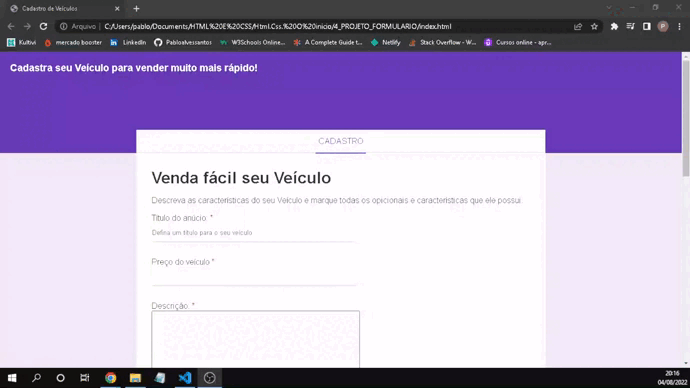

<h1 align="center">CADASTRO DE VEÍCULO</h1>

<h1 align="center">
    
</h1>

 

<h2 align="center">
   <a href="https://pablo-barber-shop.netlify.app">Acessar a demonstração</a>
<h2>

 

## 📕 Sobre o projeto 

O **barber shop** e um site a onde os clientes podem agendar seu horário para fazer barba e cabelo, que foi criado dentro do curso formação full stack javascript com intuito de colocarmos em prática o conteúdo de html e css.

## 🛠 Tecnologias

As seguintes ferramentas foram usadas na construção do projeto:

- HTML
- CSS Puro

Desenvolvido por **Pablo alves santos**

Meu Linkedin: [Pablo.A](https://www.linkedin.com/in/pablo-santos-6b6460243/)